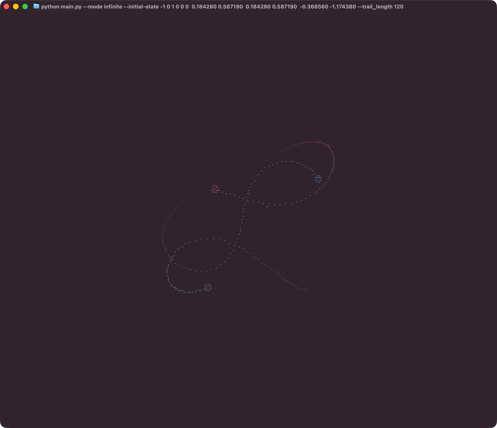
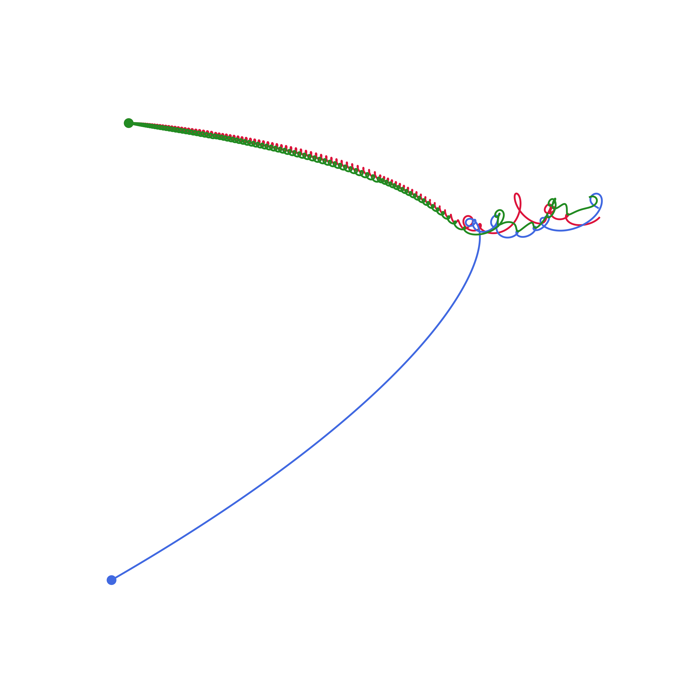

# TriSolaris

A command-line based 3-body problem visualiser, simulator, and renderer, with live terminal-visual modes, png-render output, or infinite brute-force configuration finder functions. Highly customisable; every aspect from masses, gravity, positions and velocities, simulation time steps, etc. can be customised with extensive CLI flags. Great as a screen saver, or for accurate (rk4) renders of three bodies.

Originally built out of a love for TUI visualisers (following cellular automaton and boid terminal braille visualisers) and inspired by the book, I stumbled upon matplotlib renders and the stupidly chaotic nature of three-body configurations, and decided to build a single tool to conquer it all; renders, live visualisations, and state/configuration finders!

To install:

```bash
pip install trisolaris
brew tap bitpeppr/homebrew-formulae && brew install trisolaris
```

> Note that there currently Homebrew install returns an install error, yet trisolaris installs fine and runs well. I'm working to solve this, sorry for the confusion!

To use:

```bash
trisolaris # Default, random single render
trisolaris --initial-state ... # Custom initial state, with masses, positions, velocities
trisolaris --mode infinite # Infinite, terminal-based braille visualisation, updating live.
trisolaris -h # For more options and details, check out help menu
```




